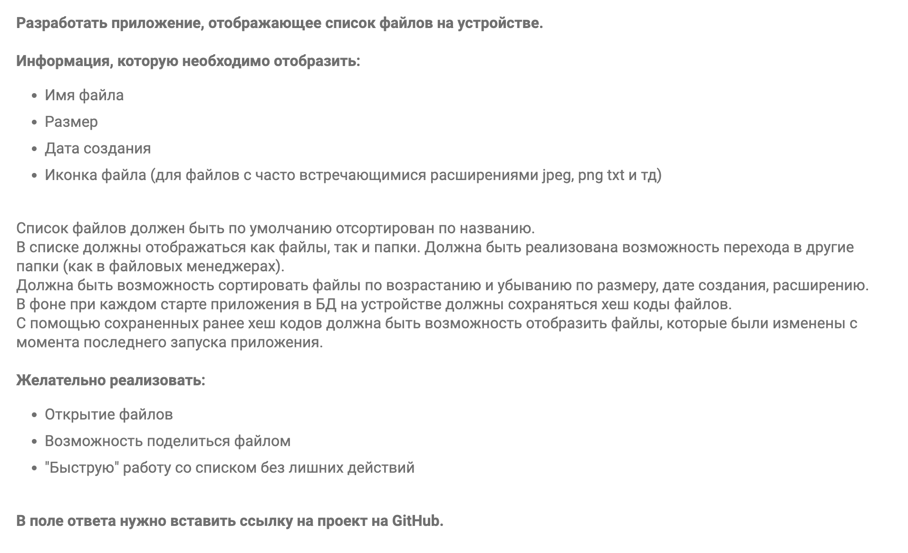
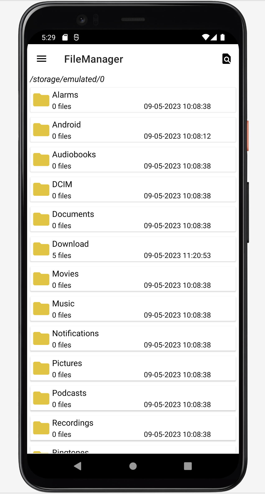
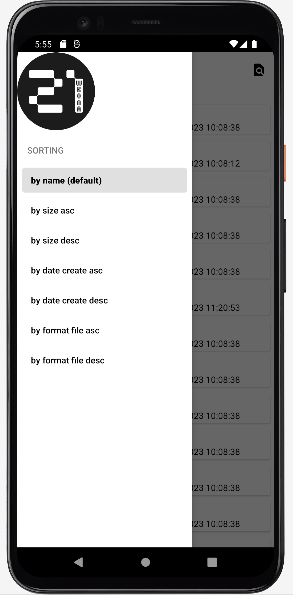
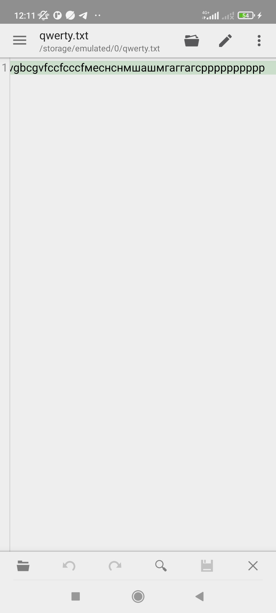
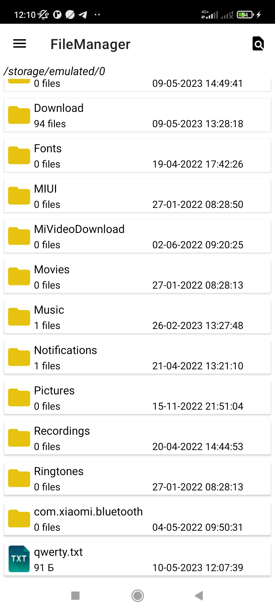
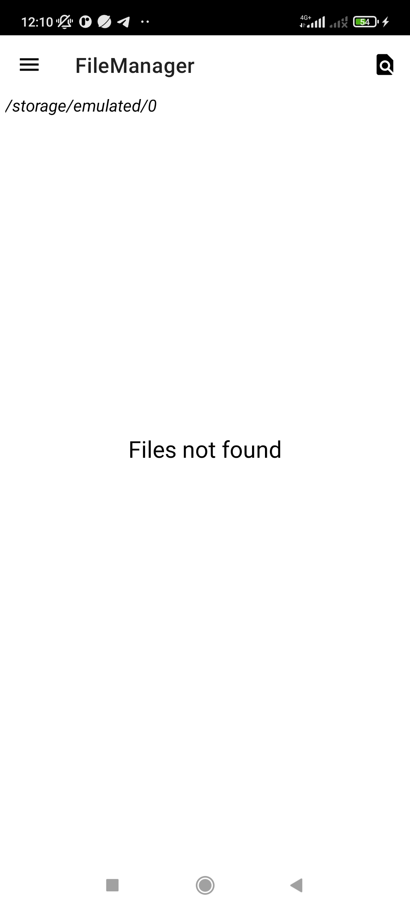
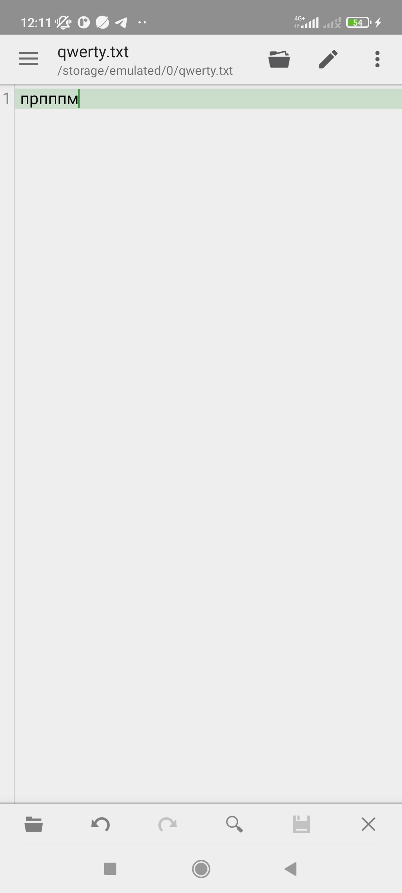
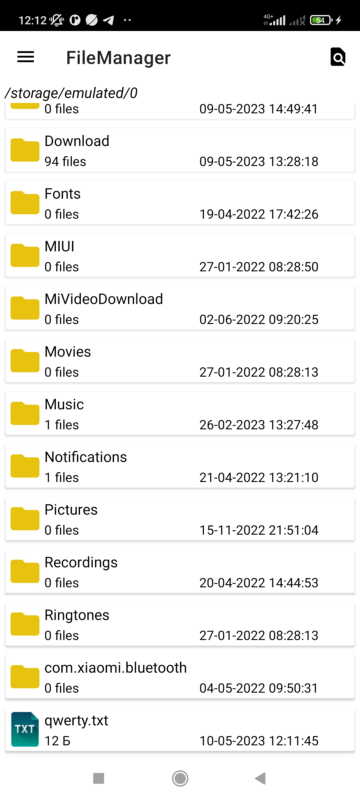
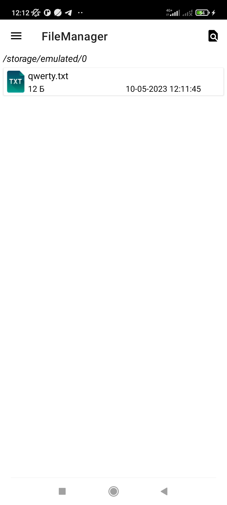

# Техническое задание

# Реализация

Главный вид представляет из себя список элементов (папки и файлы). Каждый элемент списка содержит в себе следующую информацию: 
1) название элемента
2) размер файла / количество файлов внутри
3) дата последнего изменения / дата создания файла
4) иконка элемента

### По поводу п.3: 
До api 26 информация о создании файла является не доступной / не хранится в системе. Поэтому для ранних версий используется информация о времени крайнего изменения элемента. В более новых версиях информация о создании файла уже является доступной

### По поводу п.4:
Приложение отображает следующие иконки:

 avi - расширение

 bmp - расширение

 doc - расширение

 jpg, jpeg - расширение

 mp3 - расширение

 mp4 - расширение

 pdf - расширение

 png - расширение

 txt - расширение

 wav - расширение

Также реализованы иконки под остальные файловые расширения и для директорий

Выбор сортировки реализован в скрытом меню, которое открывается при нажатии на кнопки в верхнем левом углу экрана или же свайпом вправо

При смене режима сортировки порядок файлов происходит сразу же

При каждом запуске приложения происходит заполнение базы данных в виде сущности, состоящей из абсолютного пути файла и его хэш-значения по кодировке SHA256. При каждом новом запуске приложения формируется список файлом, хэш - значения которых были изменены. Эти файлы можно увидеть по нажатии на иконку справа вверху. При повторном нажатии на иконку отображается список файлов по указанному пути.

## Реализация поиска

### Содержание файла

### Размер файла

### Отображение файлов, которые были изменены

### Содержание файла при следующем запуске приложения

### Новый размер файла

### Отображение файлов, которые были изменены

## Дополнительные моменты:

Приложение запрашивает доступ к файлам телефона. Также в новых системах с api более 29 запрашивается доступ ко ВСЕМ файлам в телефоне

Системной клавише назад и TextView с отображением абсолютного пути присвоены команды перехода на уровень вверх до корневого элемента

### Задачи из задания реализованы, кроме последнего пункта с "быстрой" работой со списком (задача носталась не ясна)